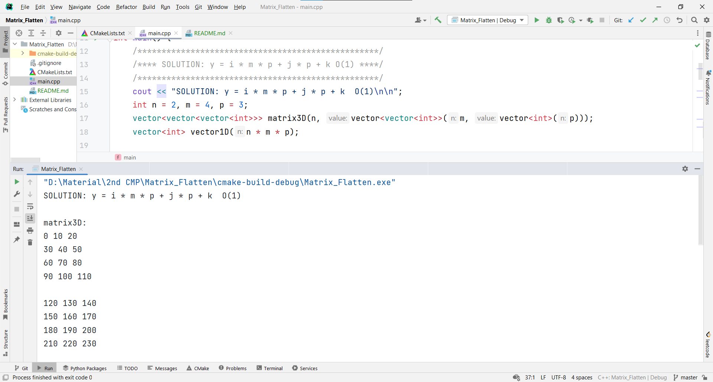
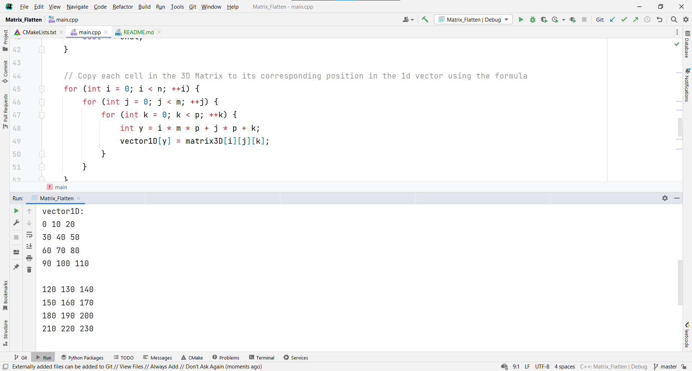
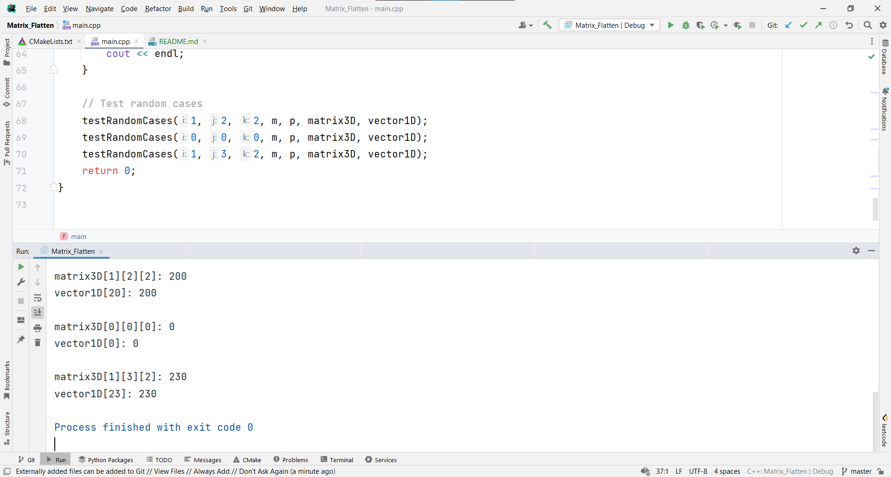

<div align="center">

# Matrix Flatten

</div>

<div align="center">

[](https://github.com/Abd-ELrahmanHamza/Matrix_Flatten/contributors)
[](LICENSE)
[](https://github.com/Abd-ELrahmanHamza/Matrix_Flatten/network)
[](https://github.com/Abd-ELrahmanHamza/Matrix_Flatten/stargazers)
[](https://github.com/Abd-ELrahmanHamza/Matrix_Flatten/issues)

</div>

A 3D matrix is to be stored in a 1D vector (flattened).
## Description
* Convert the 3D matrix index (i, j, k) to a suitable 1D vector index (y). Must be O(1).

## Getting Started

### Dependencies

* C++

### Installing

```
git clone https://github.com/Abd-ELrahmanHamza/Matrix_Flatten 
```

```
gcc main.cpp
```

```
./a.out
```

### Screenshots

#### Fill 3D matrix with unique numbers


#### Convert 3D matrix into 1D vector using the formula y = i * m * p + j * p + k


#### Test random cases



## Contributors

<table>
<tr>
<td align="center">
<a href="https://github.com/Abd-ELrahmanHamza" target="_black">
<br /><sub><b>Abdelrahman Hamza</b></sub></a><br />
</td>
</tr>
 </table>

## License

This project is licensed under the [MIT] License - see the [LICENSE.md](LICENSE) file for details
